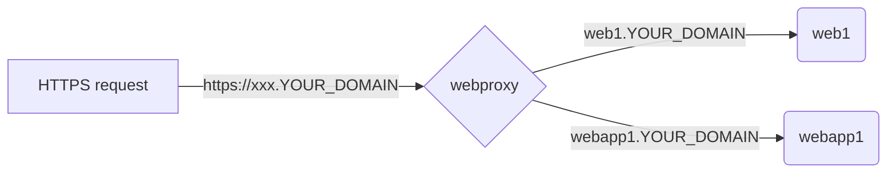

# letsencrypt-nginx-multiple-webapp-example

An example how to set up multiple web/web app on a VM using Let's encrypt, Nginx and Docker compose.

## Scenario

## Files
#### Main
**webproxy** -- is the main web proxy for each projects in our VM
#### Example projects
**web1** -- a Wordpress web example with MariaDB (only configuration)
**webapp1** -- a Nextjs webapp example with PostgresDB (only configuration).

## How to configure
>**You need to have your domain name first** to use Let's encrypt. 

Then edit  *docker-compose.yml* in **webproxy** then edit *docker-compose.yml* in each project.

## How to start

`docker-compose up` at */webproxy* then,
`docker-compose up` at each sub directory to start each web/webapp

## How to access each web/webapp

web1 -- `https://web1.YOUR_DOMAIN_NAME`
webapp1 - `https://web1.YOUR_DOMAIN_NAME`
webapp1 API - `https://web1.YOUR_DOMAIN_NAME/api/YOUR_API`